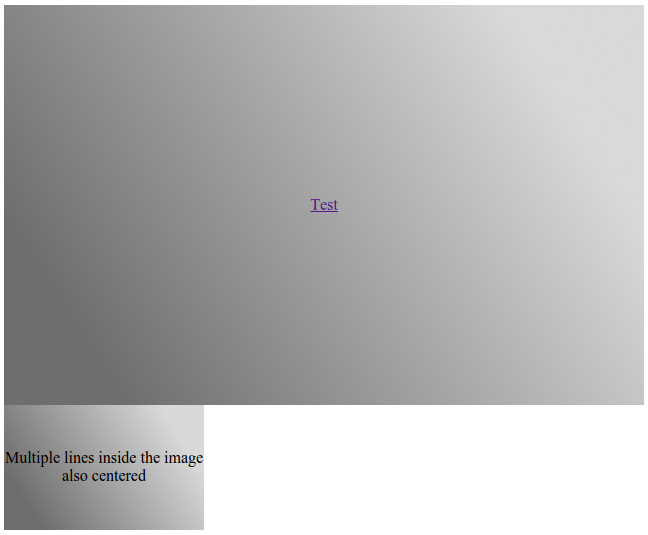

# PXN IMAGES WITH CENTERED CONTENT

This is a web component created using [Polymer](https://www.polymer-project.org/) to add images that have a centered content. For example if you want to have a link inside an image.

## INSTALL

To use this code, you can use [Bower](http://bower.io/) to satisfy the dependencies. To do so, use the following command.
> bower update

## USING IT

I suggest adding [webcomponents.js](http://webcomponents.org/)

```
<script src="../bower_components/webcomponentsjs/webcomponents.js"></script>
```

Import px-iwcc.html file into your HTML head section
```
<link rel="import" href="../pxn-iwcc.html">
```

Then you can use the following tag
```
<pxn-iwcc src="..." alt="...">
  ...
</pxn-iwcc>
```

## EXAMPLE

Two images with centered content

